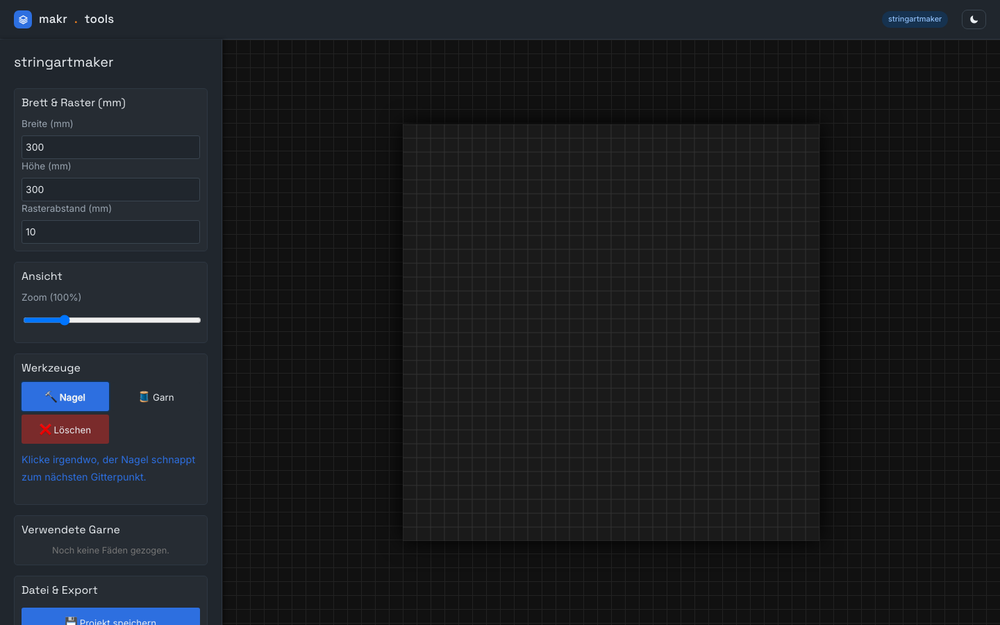
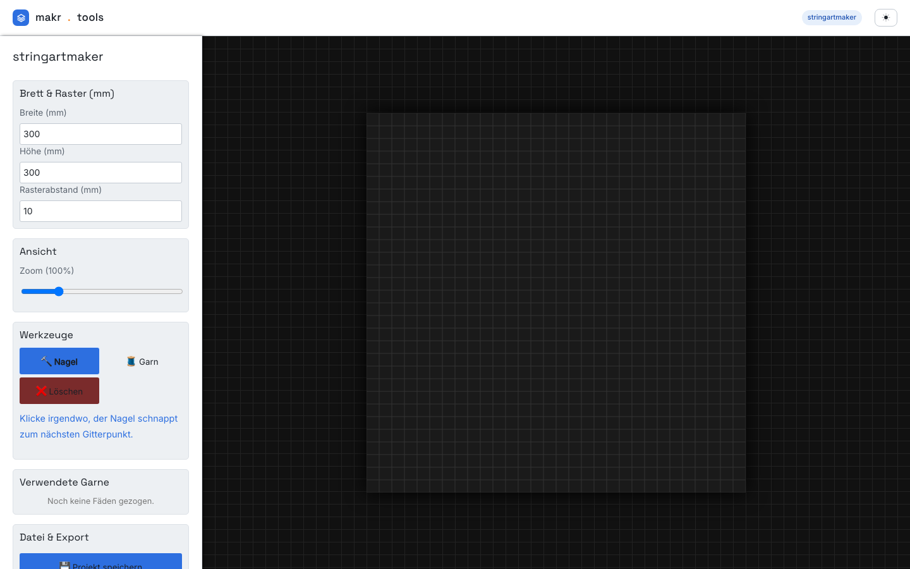

# stringartmaker

**String Art planen — Nägel setzen, Fäden spannen, Bauplan mitnehmen.**

stringartmaker ist ein Entwurfswerkzeug für String Art: Du setzt Nägel auf ein
Raster, spannst farbige Fäden zwischen ihnen und bekommst am Ende nicht nur eine
SVG-Vorlage, sondern einen kompletten **Bauplan** — Nagel-Positionen in mm und eine
Fädel-Anleitung zum Nachbauen am echten Brett.

Die App läuft komplett im Browser. Kein Konto, kein Build, keine Cloud — eine
HTML-Datei und ein paar lokale Assets.

<p align="center">
  
  
</p>

<p align="center"><em>Umschaltbar zwischen dunklem und hellem Theme — der Schalter oben rechts merkt sich die Wahl. Das Brett bleibt bewusst dunkel als Bühne für Nägel und Fäden.</em></p>

---

## Was es kann

- **Brett & Raster** frei in mm — Nägel schnappen beim Klick auf den nächsten
  Rasterpunkt.
- **Fäden im Polylinien-Modus:** einmal starten, dann von Nagel zu Nagel weiterklicken.
- **Mehrere Garnfarben** mit automatischer Legende und Zählung je Farbe.
- **Bauplan-Generator:** Materialliste, Nagel-Koordinaten und eine nummerierte
  Fädel-Anleitung — direkt kopierbar.
- **SVG-Export** der Vorlage, **Speichern & Laden** als JSON.
- **Hell & Dunkel** per Schalter, die Wahl bleibt gespeichert.

---

## Loslegen

stringartmaker ist eine statische Seite. Am einfachsten:

```bash
git clone https://github.com/malandereideen/stringartmaker.git
cd stringartmaker
python3 -m http.server 8000
```

Dann [http://localhost:8000](http://localhost:8000) öffnen. (Direkt per Doppelklick
auf `index.html` geht auch — der lokale Server vermeidet nur eventuelle
Browser-Warnungen beim Laden der Schriftarten.)

---

## So arbeitest du

1. **Brett festlegen.** Breite, Höhe und Rasterabstand in mm.
2. **Nägel setzen** mit dem Nagel-Werkzeug — sie schnappen aufs Raster.
3. **Fäden spannen** mit dem Garn-Werkzeug: Nägel nacheinander anklicken, Farbe frei
   wählbar.
4. **Bauplan holen.** *Bauplan (Text)* öffnet Positionen und Fädel-Anleitung zum
   Kopieren; *SVG Export* schreibt die Vorlage.

---

## Technik

Reines HTML, CSS und JavaScript ohne Build-Schritt, keine Laufzeit-Abhängigkeiten.
Das Brett ist ein natives SVG, Nägel und Fäden sind echte SVG-Elemente — der Export
ist damit nur ein Abzug der Szene. Schriftarten sind lokal im Ordner `fonts/`
gebündelt — die App läuft vollständig offline.

Teil von **makr.tools**, einer Sammlung kleiner, self-hosted Maker-Werkzeuge.

---

## Entstehung

stringartmaker ist im Vibe Coding entstanden — komplett im Gespräch mit einer KI
gebaut, ohne selbst eine Zeile zu tippen. Die Idee, der Aufbau, die Entscheidungen:
alles aus meinem Kopf und aus meiner Erfahrung als NC-Programmierer und Maker. Den
Code hat die KI geschrieben, Schritt für Schritt, immer sofort im Browser überprüft.

Ich zeige damit gern, wie weit man heute mit diesem Ansatz kommt — von der ersten
Idee bis zum lauffähigen Werkzeug.

---

## Lizenz

MIT — siehe [LICENSE](LICENSE).
